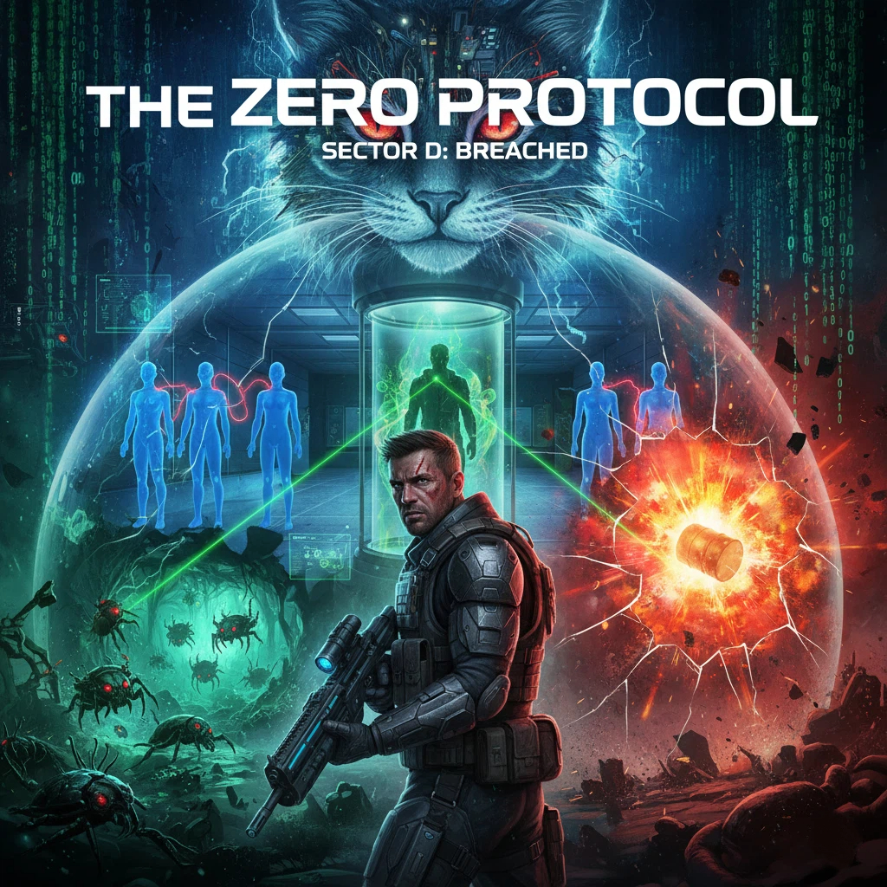

🎮 THE ZERO PROTOCOL

**Still in developing**

Welcome to The Zero Protocol, a sci-fi thriller that blends stealth, puzzles, and intense combat into one hell of a ride. 
You play as Zero, an elite spec-ops soldier sent on what seems like a routine infiltration of a top-secret biochemical base. 
But the second you step inside, the walls start to bleed code, and reality begins to warp. You’re about to find out that this mission isn't what you signed up for... and the world isn't what it seems.

⚡ A World Built on Lies
Explore a massive facility split into distinct sectors, each hiding its own dirty little secrets.

Sector A: The facility's automated defense system has deployed Cyber-Beetles—aggressive, bio-mechanical guard drones designed to protect the perimeter. These aren't just pests; they act as mobile power nodes for the sector's security grid. 
To shut down the hazardous rotating barriers blocking your path, you'll need to 'neutralize' every last one of them. Clean the path, or you'll never reach the Access Card.

Sector B: You’ll find yourself surrounded by eerie blue mannequins. To pass, you’ve got to turn them all Red. But here’s the catch: they’re all interlinked. Shooting one flips the colors of the ones next to it. It is about logic.

Sector B2: HQ needs to ensure your gear can handle the contamination. You'll enter the Bio-Scan Chamber for a full physical synchronization. Your main objective here is to Tune the Frequency of your comms and neural-link to prevent feedback interference from the base's heavy shielding. 

Sector C: You'll need to manually Stabilize the Pressure Tubes. if the facility's containment fails, your vitals will flatline. Keep your head cool, sync your suit, and don't let the pressure drop

🤖 Your Voice in the Dark
Your only ally is Artemis, a mysterious AI who knows way more than she’s letting on. She’ll guide you through the glitches, but as the mission goes deep, you’ll start to uncover the truth about her—and the "Cats" pulling the strings from behind the curtain.

💥 Breaking the Rules (Sector D)
They told you Sector D was off-limits. They lied. Through a "happy accident" involving an explosion, you’ll breach the forbidden zone. This is where the simulation cracks. You’ll face the system glitches and stare directly into the eyes of the ones watching you.

🛠️ Technical Implementation
* **Sequential Narrative Delivery**: Used Coroutine patterns to handle non-blocking typewriter effects, ensuring narrative flow remains smooth without affecting game performance.
* **Context-Sensitive Dialogue System**: Used Spatial Triggers to activate location-based dialogue. The system adapts feedback based on current game objectives (e.g., Sector C tasks done).
* **Interface-Based Interaction**: Used IDamageable Interface to decouple combat from object logic. Player can to interact with diverse entities such as beetles to explosive environmental hazards using a single unified system.
* **Game Architecture & Optimization**: Developed a modular codebase using Inheritance such as DestructibleObject. This allows rapid usage of new interactive elements like "The walls behind the truth" without duplicating code.
* **Physics & Collision Management**: Enemy encounters (Beetles) using OverlapSphere checks for explosion damage and optimized Rigidbody physics for environmental interactions.

© 2026 Developed by @halokaiwei. All Rights Reserved.
